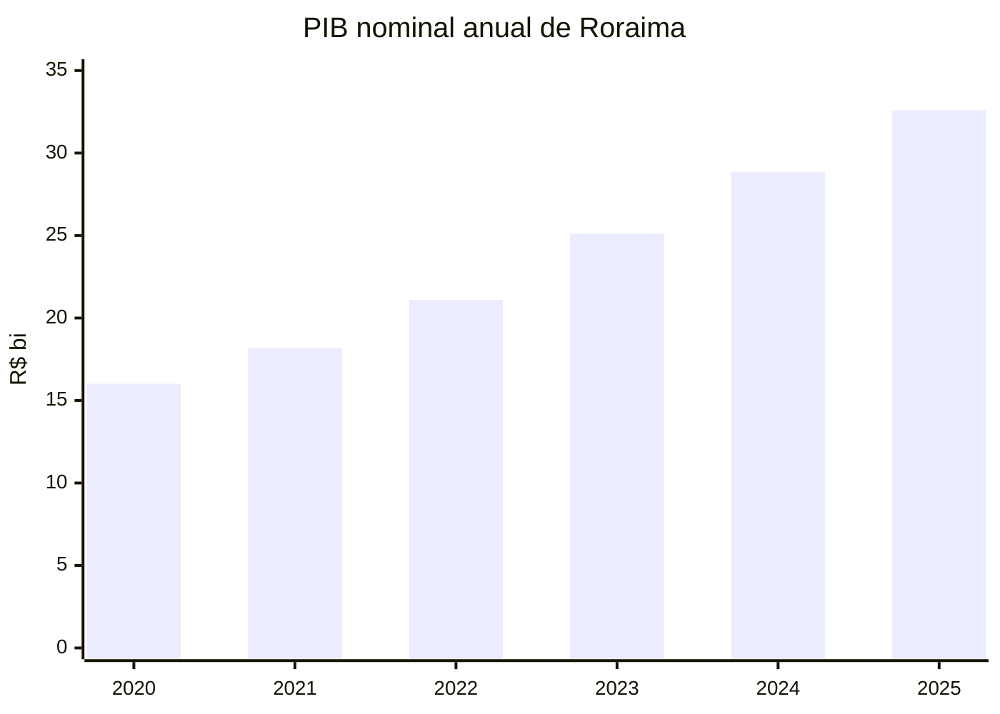
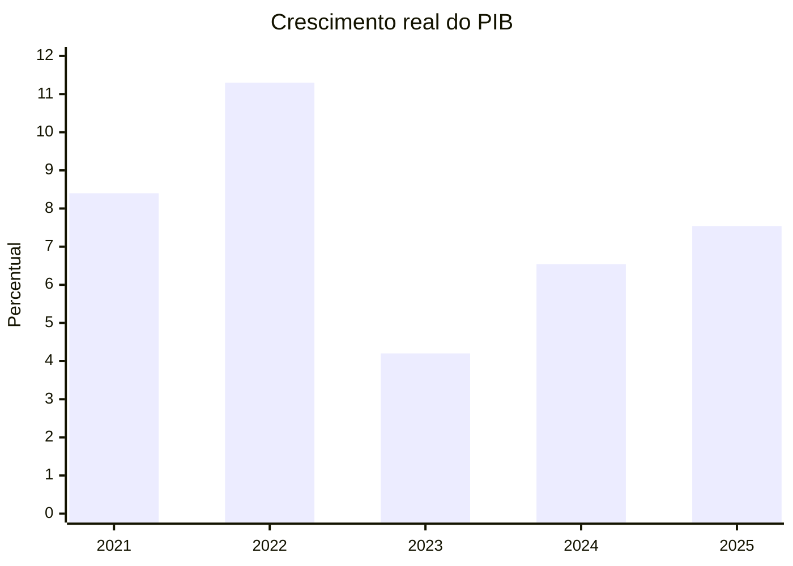
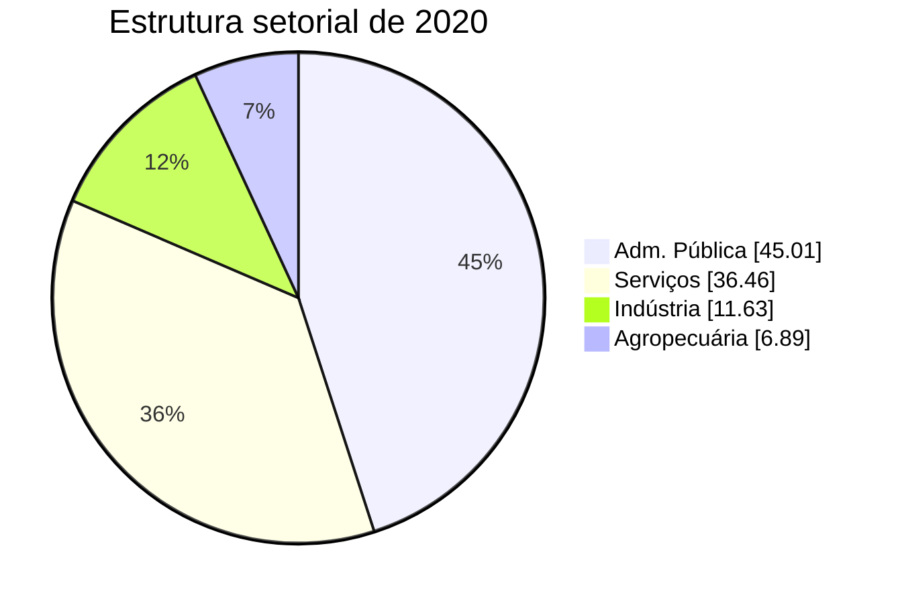
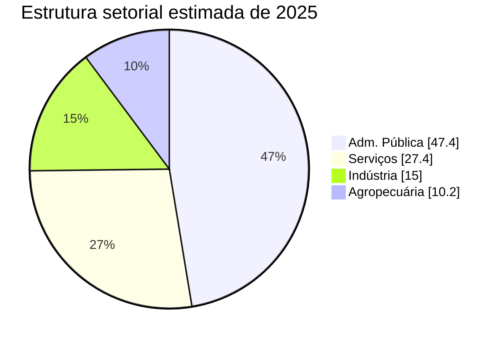

# IAET-RR
## Pitch de Venda do Projeto

**Indicador de Atividade Econômica Trimestral de Roraima**

- Proposta: transformar dados dispersos em uma leitura trimestral da economia de Roraima
- Público: gestores, imprensa, setor produtivo e sociedade
- Entrega principal: um “termômetro” econômico estadual com metodologia rastreável

---

## O Problema

- O PIB estadual oficial existe, mas sai com defasagem
- A gestão pública precisa decidir antes do dado oficial chegar
- Sem um indicador trimestral, o debate econômico fica “no escuro”

**Intuição**

- É como dirigir olhando só pelo retrovisor de dois anos atrás
- O projeto cria um painel de bordo para acompanhar a economia quase em tempo real

---

## A Solução

- Construir um indicador trimestral de atividade econômica para Roraima
- Ancorar o projeto na metodologia das Contas Regionais do IBGE
- Produzir séries reais e nominais, por setor e para o agregado

**Em linguagem simples**

- O projeto junta vários sinais da economia
- Organiza esses sinais por setor
- Ajusta tudo para “falar a mesma língua”
- E entrega uma leitura única, comparável no tempo

---

## O Que o Projeto Entrega

- `IAET-RR`: indicador trimestral de atividade econômica
- `PIB nominal trimestral`
- `PIB real trimestral`
- `VAB nominal setorial`
- Dashboard interativo
- Relatórios de comparação com as Contas Regionais
- Base exportável para Excel e CSV

---

## Como Explicar a Metodologia para um Leigo

### 1. Separar a economia em grandes peças

- Agropecuária
- Adm. Pública
- Indústria
- Serviços

### 2. Escolher “termômetros” para cada peça

- Exemplo:
  folha de pagamento ajuda a ler a Adm. Pública
- Exemplo:
  energia, emprego, transporte e crédito ajudam a ler produção e serviços

### 3. Ajustar esses termômetros ao dado oficial anual

- O projeto não “chuta” um PIB trimestral solto
- Ele força as médias anuais a fecharem com o benchmark oficial disponível

**Intuição**

- É como usar vários sensores para estimar a velocidade de um carro
- Depois, no fim do ano, conferir se o hodômetro oficial confirma o caminho

---

## A Lógica Estatística, Sem Jargão Excessivo

- O IBGE publica o retrato anual
- O projeto constrói o filme trimestral

**Como isso acontece**

- As Contas Regionais dizem “quanto o ano valeu”
- As proxies trimestrais dizem “como esse ano se distribuiu ao longo dos trimestres”

**Resultado**

- A série trimestral respeita o dado oficial anual
- Mas também preserva o movimento intra-anual da economia

---

## Fontes Usadas

| Bloco | Exemplos de insumos |
|---|---|
| Agropecuária | produção agrícola e pecuária |
| Adm. Pública | folhas federal, estadual e municipal |
| Indústria | energia, emprego, construção |
| Serviços | comércio, transporte, crédito, emprego |

**Mensagem de venda**

- O projeto usa dados que já existem
- O valor está em integrar, limpar, ponderar e transformar isso em inteligência pública

---

## Por Que Isso É Forte Metodologicamente

- Baseado em benchmark oficial do IBGE
- Estrutura de pesos compatível com as Contas Regionais
- Separação entre crescimento real e valores nominais
- Rastreabilidade por script e por arquivo
- Atualização replicável

**Intuição**

- Não é “um gráfico bonito”
- É uma máquina de produção estatística, com lógica auditável

---

## Resultado 1
## PIB de Roraima em Valores Anuais

| Ano | PIB nominal |
|---|---:|
| 2020 | R$ 16,02 bi |
| 2021 | R$ 18,20 bi |
| 2022 | R$ 21,10 bi |
| 2023 | R$ 25,12 bi |
| 2024 | R$ 28,86 bi |
| 2025 | R$ 32,59 bi |

**Leitura rápida**

- O projeto mostra crescimento forte do tamanho da economia estadual
- Isso ajuda a comunicar escala, arrecadação potencial e dinamismo econômico

---

## Resultado 2
## Crescimento Real do PIB

| Ano | Crescimento real |
|---|---:|
| 2021 | 8,40% |
| 2022 | 11,30% |
| 2023 | 4,20% |
| 2024 | 6,54% |
| 2025 | 7,54% |

**Ponto importante**

- Nos anos com benchmark oficial disponível, a taxa anual do PIB real foi ancorada às Contas Regionais
- Isso aumenta muito a credibilidade do indicador

---

## Resultado 3
## Estrutura Setorial da Economia

### Estrutura de 2020

| Setor | Participação |
|---|---:|
| Adm. Pública | 45,01% |
| Serviços | 36,46% |
| Indústria | 11,63% |
| Agropecuária | 6,89% |

**Leitura simples**

- Roraima tem peso muito alto do setor público
- Isso muda a forma de interpretar ciclos econômicos no estado

---

## Resultado 4
## Estrutura Setorial Mais Recente

### Estimativa de 2025

| Setor | VAB nominal | Participação |
|---|---:|---:|
| Adm. Pública | R$ 15,74 bi | 47,4% |
| Serviços | R$ 9,08 bi | 27,4% |
| Indústria | R$ 4,97 bi | 15,0% |
| Agropecuária | R$ 3,39 bi | 10,2% |

**Mensagem de negócio**

- O projeto não entrega só “crescimento”
- Ele mostra também “de onde vem o crescimento”

---

## O Diferencial do Projeto

- Foi desenhado para a realidade específica de Roraima
- Não replica mecanicamente um indicador nacional
- Converte bases administrativas em produto estatístico público
- Permite atualização contínua
- Cria linguagem comum entre técnica, gestão e comunicação

**Em uma frase**

- O projeto transforma burocracia em inteligência econômica

---

## O Dashboard

### O que o painel já permite

- acompanhar o índice geral
- abrir os componentes por setor
- ver PIB nominal e PIB real
- visualizar VAB nominal setorial
- exportar bases

### Valor para o usuário

- menos tempo procurando dados
- mais tempo interpretando e decidindo

---

## Relatórios Futuros

### Linha de produtos que pode crescer

- boletins trimestrais de conjuntura
- notas executivas para o governador e secretarias
- relatórios setoriais
- comparações com Norte, Brasil e arrecadação
- materiais para imprensa e investidores

**Ideia-chave**

- O projeto não é apenas um indicador
- É uma plataforma de comunicação econômica do estado

---

## Benefício para a Gestão Pública

- melhora o timing das decisões
- ajuda a monitorar políticas públicas
- apoia discurso institucional com base empírica
- cria memória estatística estadual
- reduz dependência de leituras improvisadas

---

## Benefício para o Mercado e para a Sociedade

- melhora a previsibilidade
- ajuda empresários a entenderem o ciclo econômico
- qualifica o debate público
- valoriza a capacidade técnica do estado

---

## Mensagem Final

### O que está sendo vendido aqui

- um projeto técnico
- com aplicação prática
- comunicação simples
- e alto valor institucional

### Em resumo

- o IBGE entrega o retrato anual
- o projeto entrega o acompanhamento trimestral
- o painel entrega acesso rápido
- os relatórios futuros entregam narrativa e decisão

---

## Fechamento

**IAET-RR**

- metodologia sólida
- linguagem acessível
- resultados concretos
- utilidade imediata

**Proposta de valor**

- colocar Roraima entre os estados com melhor leitura conjuntural da própria economia
