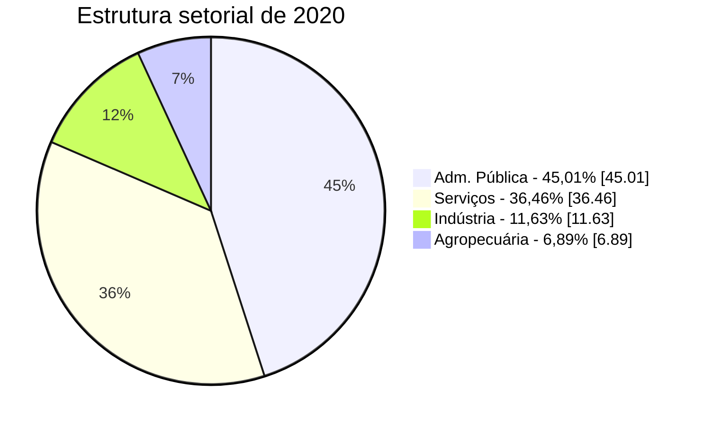
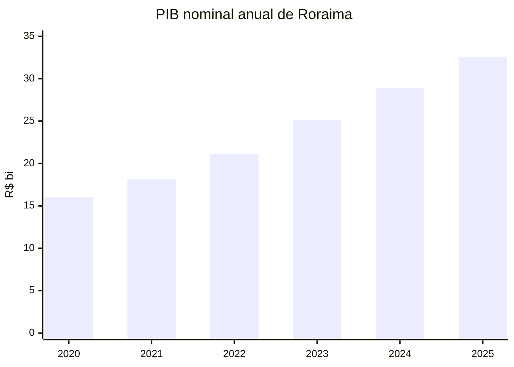
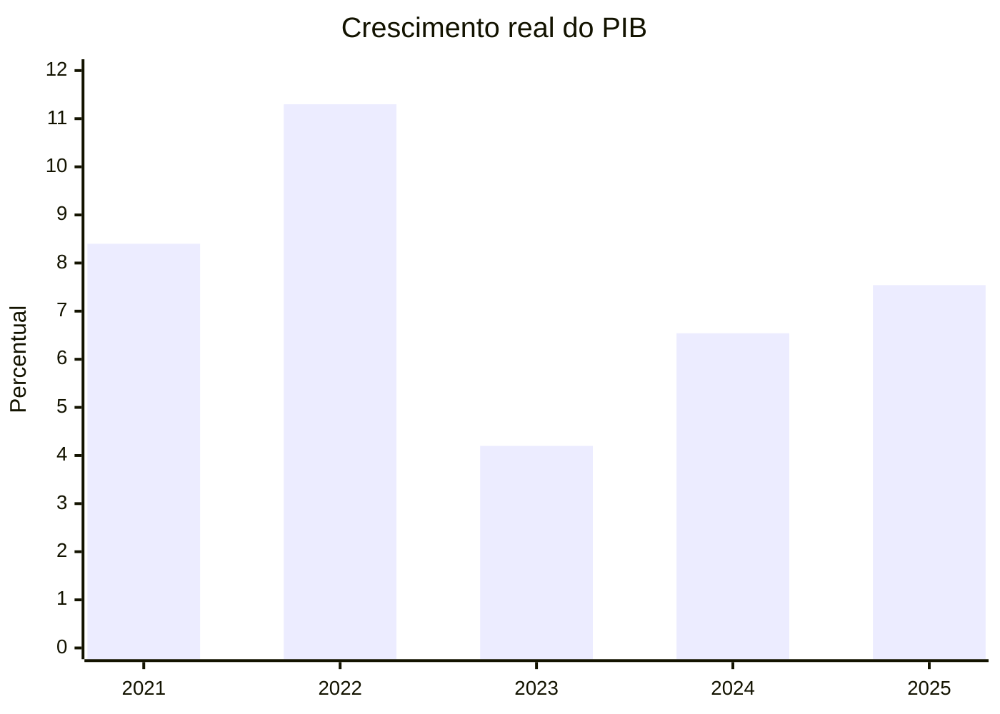
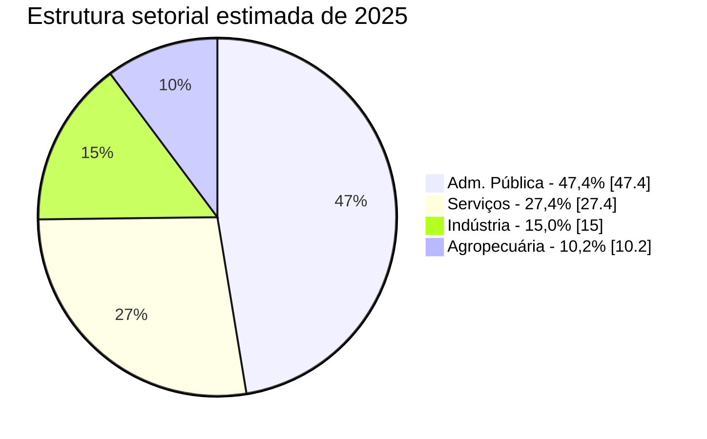

# IAET-RR
## Apresentação Técnica para Defesa do Projeto

**Indicador de Atividade Econômica Trimestral de Roraima**

- Objetivo: produzir uma leitura trimestral da economia de Roraima compatível com a lógica das Contas Regionais
- Posição institucional: instrumento de acompanhamento conjuntural, não substituto das Contas Regionais do IBGE
- Proposta de valor: antecipar leitura econômica com consistência metodológica e linguagem de gestão

---

## Qual lacuna o projeto resolve

- O IBGE divulga as Contas Regionais em frequência anual e com defasagem
- A gestão precisa de leitura trimestral para monitoramento, comunicação e decisão
- O projeto cria uma ponte entre:
  dados administrativos e setoriais de alta frequência
  e
  o arcabouço anual das Contas Regionais

**Mensagem central**

- O projeto não “inventa um PIB trimestral”
- Ele trimestraliza informação econômica observável, disciplinada por benchmark anual oficial

---

## O Produto Estatístico

### Saídas principais

- índice trimestral de atividade econômica em volume
- série dessazonalizada
- VAB nominal trimestral
- PIB nominal trimestral
- PIB real trimestral
- VAB nominal setorial
- dashboard interativo

### Lógica de uso

- conjuntura de curtíssimo prazo
- monitoramento setorial
- comunicação institucional
- base para boletins e notas técnicas periódicas

---

## Princípio Metodológico

### Estrutura geral

1. construir indicadores trimestrais por setor
2. agregar com pesos compatíveis com o ano-base
3. impor coerência com benchmark anual oficial
4. derivar séries nominais e reais consistentes

### Intuição

- as Contas Regionais dizem “qual é o nível anual correto”
- as proxies trimestrais dizem “como esse nível se distribui dentro do ano”

---

## Estrutura Setorial do Projeto

### Grandes blocos

- Agropecuária
- Adm. Pública
- Indústria
- Serviços

### Pesos de referência do ano-base 2020

| Setor | Participação no VAB de 2020 |
|---|---:|
| Adm. Pública | 45,01% |
| Serviços | 36,46% |
| Indústria | 11,63% |
| Agropecuária | 6,89% |

**Leitura técnica**

- a elevada participação de Adm. Pública exige uma modelagem adaptada à estrutura econômica de Roraima
- isso diferencia o projeto de leituras genéricas baseadas apenas em proxies de mercado

---

## Agregação em Volume

### Fórmula-base

O índice agregado é construído com lógica de Laspeyres:

\[
I_t = \sum_{i=1}^{n} w_i^{(2020)} \cdot I_{i,t}
\]

onde:

- \(I_t\) = índice agregado no trimestre \(t\)
- \(I_{i,t}\) = índice do setor \(i\) no trimestre \(t\)
- \(w_i^{(2020)}\) = peso do setor \(i\) no VAB nominal do ano-base 2020

### Intuição

- a estrutura de ponderação fica fixa no ano-base
- o que varia trimestre a trimestre é o desempenho de cada setor

---

## O Papel do Denton-Cholette

### Problema

- temos benchmark anual oficial
- mas precisamos de uma trajetória trimestral consistente com esse benchmark

### Solução

Usamos Denton-Cholette para encontrar a série trimestral \(x_t\) que:

1. respeita o total ou média anual observada
2. preserva o máximo possível o movimento do indicador trimestral \(z_t\)

### Formulação conceitual

No caso de agregados em volume com benchmark anual:

\[
\sum_{q=1}^{4} x_{y,q} / 4 = B_y
\]

ou, para séries de fluxo anual:

\[
\sum_{q=1}^{4} x_{y,q} = B_y
\]

e o método minimiza a distância entre a dinâmica de \(x_t\) e a dinâmica do indicador \(z_t\).

---

## Denton-Cholette
## Intuição Econômica

- o benchmark anual fixa o “envelope” da série
- a proxy trimestral informa o “desenho intra-anual”

**Em termos práticos**

- sem benchmark anual:
  a proxy pode carregar viés de nível
- sem proxy trimestral:
  a trimestralização ficaria artificialmente uniforme
- com Denton:
  preservamos o perfil trimestral observado, mas fechando no valor anual correto

---

## Por Que Isso É Importante

- evita que o indicador trimestral “descole” das Contas Regionais
- reduz arbitrariedade na distribuição intra-anual
- produz uma série que pode ser defendida tecnicamente diante de especialistas

**Mensagem para gestão**

- o projeto antecipa a leitura da economia
- sem abrir mão da disciplina estatística do benchmark oficial

---

## Construção do VAB Nominal

### Lógica

Após obter a série em volume, o projeto deriva o nominal a partir do deflator implícito:

\[
I_t^{nom} = I_t^{real} \times \frac{D_t}{100}
\]

onde:

- \(I_t^{nom}\) = índice nominal
- \(I_t^{real}\) = índice real
- \(D_t\) = deflator implícito trimestral

### Como o deflator é obtido

1. calcula-se o deflator anual a partir das Contas Regionais
2. trimestraliza-se o deflator anual com Denton-Cholette
3. utiliza-se o IPCA como indicador auxiliar intra-anual

---

## Construção do PIB Nominal

### Identidade contábil

\[
PIB = VAB + ILP
\]

onde:

- \(VAB\) = valor adicionado bruto
- \(ILP\) = impostos líquidos sobre produtos

### No projeto

- o VAB nominal trimestral é estimado a partir do bloco real + deflator
- o ILP trimestral é distribuído com benchmark anual e proxy tributária
- o PIB nominal trimestral resulta da soma dos dois componentes

---

## Construção do PIB Real

### Etapa 1

Gerar uma série preliminar:

\[
PIB_t^{real,prel} = \frac{PIB_t^{nom}}{D_t/100}
\]

### Etapa 2

Calcular o índice anual preliminar e compará-lo ao benchmark oficial de crescimento real do PIB

### Etapa 3

Ancorar a trajetória trimestral por Denton-Cholette para que a média anual coincida com o benchmark oficial do PIB real

**Ponto metodológico forte**

- isso resolve o problema clássico da variação real dos impostos sobre produtos contaminar a leitura do PIB real

---

## Benchmarking do PIB Real

### Resultado da ancoragem anual

| Ano | Projeto | CR IBGE |
|---|---:|---:|
| 2021 | 8,40% | 8,40% |
| 2022 | 11,30% | 11,30% |
| 2023 | 4,20% | 4,20% |

**Leitura**

- nos anos com benchmark oficial disponível, o crescimento real anual do PIB do projeto coincide com as Contas Regionais
- isso fortalece a legitimidade da série trimestral derivada

---

## Resultados
## PIB Nominal Anual

| Ano | PIB nominal |
|---|---:|
| 2020 | R$ 16,02 bi |
| 2021 | R$ 18,20 bi |
| 2022 | R$ 21,10 bi |
| 2023 | R$ 25,12 bi |
| 2024 | R$ 28,86 bi |
| 2025 | R$ 32,59 bi |

**Rótulos das colunas**

- 2020: 16,02
- 2021: 18,20
- 2022: 21,10
- 2023: 25,12
- 2024: 28,86
- 2025: 32,59

---

## Resultados
## Crescimento Real do PIB

| Ano | Crescimento real |
|---|---:|
| 2021 | 8,40% |
| 2022 | 11,30% |
| 2023 | 4,20% |
| 2024 | 6,54% |
| 2025 | 7,54% |

**Rótulos das colunas**

- 2021: 8,40%
- 2022: 11,30%
- 2023: 4,20%
- 2024: 6,54%
- 2025: 7,54%

---

## Resultados
## Estrutura Setorial Estimada de 2025

| Setor | VAB nominal | Participação |
|---|---:|---:|
| Adm. Pública | R$ 15,74 bi | 47,4% |
| Serviços | R$ 9,08 bi | 27,4% |
| Indústria | R$ 4,97 bi | 15,0% |
| Agropecuária | R$ 3,39 bi | 10,2% |

**Leitura**

- o projeto entrega não apenas o agregado
- entrega também decomposição setorial para narrativa econômica e institucional

---

## Arquitetura do Pipeline

### Sequência lógica

1. construir setores reais
2. agregar o índice geral
3. dessazonalizar
4. validar
5. gerar VAB nominal
6. gerar PIB nominal
7. gerar PIB real
8. gerar VAB nominal setorial
9. publicar no painel

### Ganho institucional

- processo replicável
- auditável
- com baixo custo marginal de atualização

---

## O Dashboard

### Entregas já operacionalizadas

- leitura do índice geral
- leitura setorial
- PIB nominal
- PIB real
- VAB nominal setorial
- exportação de bases

### Valor

- reduz atrito entre produção técnica e uso gerencial
- transforma um pipeline estatístico em produto de comunicação pública

---

## Próximas Entregas

### Curto prazo

- boletins trimestrais de conjuntura
- notas executivas para alta gestão
- consolidação narrativa do dashboard

### Médio prazo

- relatórios temáticos por setor
- comparações sistemáticas com CR, IBCR, IBC-Br e arrecadação
- rotina institucionalizada de atualização

---

## Como Vender o Projeto Institucionalmente

### O argumento técnico

- aderência metodológica às Contas Regionais
- uso disciplinado de benchmark anual oficial
- separação clara entre séries reais e nominais
- solução explícita para a ancoragem do PIB real

### O argumento de gestão

- ganho de tempestividade
- ganho de inteligibilidade
- ganho de autonomia analítica do estado

---

## Mensagem Final

### O projeto entrega três camadas ao mesmo tempo

- estatística
- gestão
- comunicação

### Síntese

- o IBGE fornece o benchmark anual
- o projeto fornece a leitura trimestral
- o dashboard fornece usabilidade
- os relatórios futuros fornecem narrativa econômica oficial

**Proposta de valor**

- colocar a SEPLAN/RR em posição de referência na leitura conjuntural da economia estadual
